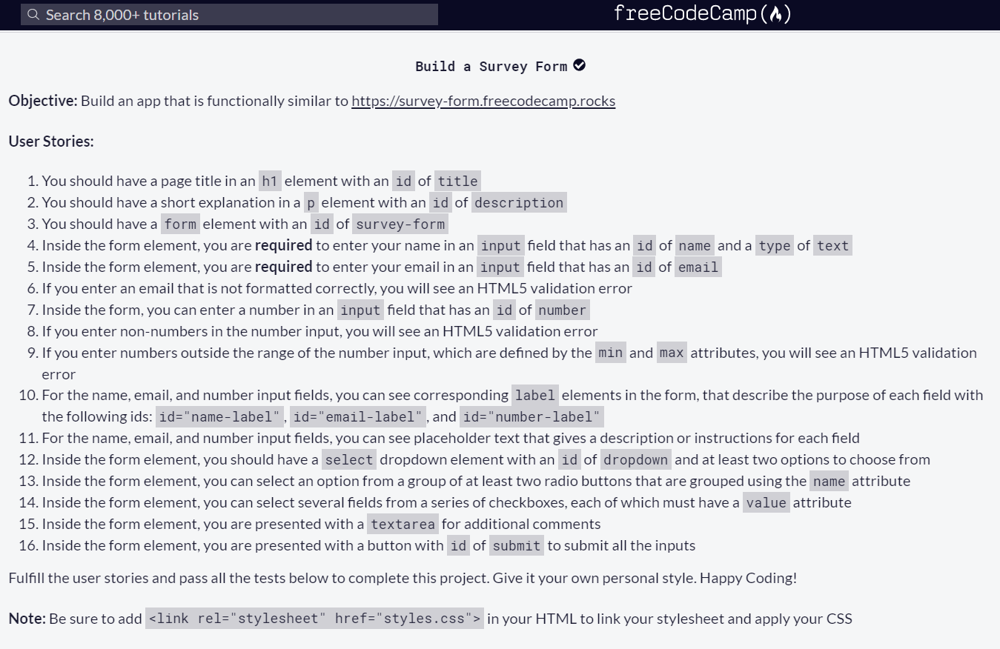

# freeCodeCamp - Survey Form

## Table of Contents
  - [The Challenge](#the-challenge)
  - [Preview](#preview)
  - [Links](#links)
  - [Built with](#built-with)

### The Challenge

### Preview

### Links

- Live Site URL: [Survey Form - Netlify](https://deluxe-raindrop-8273b0.netlify.app/)

### Built with

- HTML5
- CSS3